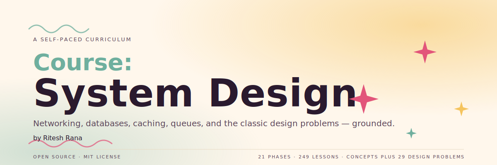

<p align="center">
  
</p>

<p align="center">
  <a href="LICENSE"></a>
  <a href="ROADMAP.md"></a>
  <a href="#contents"></a>
</p>

<p align="center"><sub>by <b>Ritesh Rana</b> &nbsp;·&nbsp; <a href="mailto:contact@riteshrana.engineer">contact@riteshrana.engineer</a></sub></p>

```
░░░▒▒▒░░░▒▒▒░░░▒▒▒░░░▒▒▒░░░▒▒▒░░░▒▒▒░░░▒▒▒░░░▒▒▒░░░▒▒▒░░░▒▒▒░░░▒▒▒░░░▒▒▒░░░▒▒▒░░░▒▒▒
```

> **249 lessons. 21 phases. ~164 hours.** Every core system design
> concept, every classic interview problem, and the distributed-systems theory underneath —
> built up from first principles. Free, open source, MIT.
>
> You don't just memorize architectures. You understand *why* each one is shaped the way it is.

## How this works

Most system design material is a pile of disconnected diagrams. A load-balancer post here, a
Kafka explainer there, a YouTube walkthrough somewhere else. The pieces rarely line up. You can
recite "use a cache" but can't say *which* cache, *where*, or what breaks when it goes stale.

This curriculum is the spine. 21 phases, 249 lessons. Networking at one end, full
system-design interviews at the other. Every concept is grounded before the design problems that
depend on it. By the time you design YouTube or a payment system, you already know the caching,
sharding, queueing, and consistency tradeoffs underneath.

```
░░░▒▒▒░░░▒▒▒░░░▒▒▒░░░▒▒▒░░░▒▒▒░░░▒▒▒░░░▒▒▒░░░▒▒▒░░░▒▒▒░░░▒▒▒░░░▒▒▒░░░▒▒▒░░░▒▒▒░░░▒▒▒
```

## The shape of a lesson

Each lesson lives in its own folder, with the same structure across the entire curriculum:

```
phases/<NN>-<phase-name>/<NN>-<lesson-name>/
├── code/      runnable implementations (where applicable)
├── docs/
│   └── en.md  lesson narrative
└── outputs/   reusable artifacts this lesson produces
```

```
░░░▒▒▒░░░▒▒▒░░░▒▒▒░░░▒▒▒░░░▒▒▒░░░▒▒▒░░░▒▒▒░░░▒▒▒░░░▒▒▒░░░▒▒▒░░░▒▒▒░░░▒▒▒░░░▒▒▒░░░▒▒▒
```

<a id="contents"></a>

## Contents

21 phases. Click any phase to expand its lesson list.

<a id="phase-0"></a>
### Phase 0: System Design Foundations `12 lessons`
> The mindset, vocabulary, and back-of-the-envelope math behind every design.

| # | Lesson | Type | Lang |
|:---:|--------|:----:|------|
| 01 | [A Framework For System Design Interviews](phases/00-foundations/01-a-framework-for-system-design-interviews/) | Learn | — |
| 02 | [Back-of-the-Envelope Estimation](phases/00-foundations/02-back-of-the-envelope-estimation/) | Learn | — |
| 03 | [Top 20 System Design Concepts You Should Know](phases/00-foundations/03-top-20-system-design-concepts-you-should-know/) | Learn | — |
| 04 | [8 System Design Concepts Explained in 1 Diagram](phases/00-foundations/04-8-system-design-concepts-explained-in-1-diagram/) | Learn | — |
| 05 | [The System Design Topic Map](phases/00-foundations/05-the-system-design-topic-map/) | Learn | — |
| 06 | [12 Algorithms for System Design Interviews](phases/00-foundations/06-12-algorithms-for-system-design-interviews/) | Learn | — |
| 07 | [The 9 Algorithms That Dominate Our World](phases/00-foundations/07-the-9-algorithms-that-dominate-our-world/) | Learn | — |
| 08 | [Latency vs. Throughput](phases/00-foundations/08-latency-vs-throughput/) | Learn | — |
| 09 | [System Performance Metrics Every Engineer Should Know](phases/00-foundations/09-system-performance-metrics-every-engineer-should-know/) | Learn | — |
| 10 | [16 Coding Patterns That Make Interviews Easy](phases/00-foundations/10-16-coding-patterns-that-make-interviews-easy/) | Learn | — |
| 11 | [24 Good Resources to Learn Software Architecture in 2025](phases/00-foundations/11-24-good-resources-to-learn-software-architecture-in-2025/) | Learn | — |
| 12 | [My Favorite 10 Books for Software Developers](phases/00-foundations/12-my-favorite-10-books-for-software-developers/) | Learn | — |

<details id="phase-1">
<summary><b>Phase 1 — Networking & The Web</b> &nbsp;<code>18 lessons</code>&nbsp; <em>From a keystroke to a packet — DNS, IP, ports, and the wires underneath.</em></summary>
<br/>

| # | Lesson | Type | Lang |
|:---:|--------|:----:|------|
| 01 | [What happens when you type google .com into a browser?](phases/01-networking-and-the-web/01-what-happens-when-you-type-google-com-into-a-browser/) | Learn | — |
| 02 | [What happens when you type a URL into a browser?](phases/01-networking-and-the-web/02-what-happens-when-you-type-a-url-into-a-browser/) | Learn | — |
| 03 | [How DNS Works](phases/01-networking-and-the-web/03-how-dns-works/) | Learn | — |
| 04 | [Structure of URL](phases/01-networking-and-the-web/04-structure-of-url/) | Learn | — |
| 05 | [TCP vs UDP](phases/01-networking-and-the-web/05-tcp-vs-udp/) | Learn | — |
| 06 | [Which Protocols Run on TCP and UDP](phases/01-networking-and-the-web/06-which-protocols-run-on-tcp-and-udp/) | Learn | — |
| 07 | [Common Network Protocols Every Engineer Should Know](phases/01-networking-and-the-web/07-common-network-protocols-every-engineer-should-know/) | Learn | — |
| 08 | [8 Popular Network Protocols](phases/01-networking-and-the-web/08-8-popular-network-protocols/) | Learn | — |
| 09 | [Must-Know Network Protocol Dependencies](phases/01-networking-and-the-web/09-must-know-network-protocol-dependencies/) | Learn | — |
| 10 | [18 Common Ports Worth Knowing](phases/01-networking-and-the-web/10-18-common-ports-worth-knowing/) | Learn | — |
| 11 | [IP Address Cheat Sheet Every Engineer Should Know](phases/01-networking-and-the-web/11-ip-address-cheat-sheet-every-engineer-should-know/) | Learn | — |
| 12 | [The Building Blocks of Modern Networking](phases/01-networking-and-the-web/12-the-building-blocks-of-modern-networking/) | Learn | — |
| 13 | [Network Services That Power Modern Connectivity](phases/01-networking-and-the-web/13-network-services-that-power-modern-connectivity/) | Learn | — |
| 14 | [Hub, Switch, & Router Explained](phases/01-networking-and-the-web/14-hub-switch-router-explained/) | Learn | — |
| 15 | [Modem vs. Router](phases/01-networking-and-the-web/15-modem-vs-router/) | Learn | — |
| 16 | [What is a Firewall?](phases/01-networking-and-the-web/16-what-is-a-firewall/) | Learn | — |
| 17 | [Network Debugging Commands Every Engineer Should Know](phases/01-networking-and-the-web/17-network-debugging-commands-every-engineer-should-know/) | Learn | — |
| 18 | [How do AirTags work?](phases/01-networking-and-the-web/18-how-do-airtags-work/) | Learn | — |

</details>

<details id="phase-2">
<summary><b>Phase 2 — HTTP & Web Protocols</b> &nbsp;<code>9 lessons</code>&nbsp; <em>The protocols the web runs on, and how they stay fast and secure.</em></summary>
<br/>

| # | Lesson | Type | Lang |
|:---:|--------|:----:|------|
| 01 | [HTTP/1 -> HTTP/2 -> HTTP/3](phases/02-http-rest-and-web-protocols/01-http-1-http-2-http-3/) | Learn | — |
| 02 | [Evolution of HTTP](phases/02-http-rest-and-web-protocols/02-evolution-of-http/) | Learn | — |
| 03 | [The HTTP Mindmap](phases/02-http-rest-and-web-protocols/03-the-http-mindmap/) | Learn | — |
| 04 | [Common HTTP Status Codes](phases/02-http-rest-and-web-protocols/04-common-http-status-codes/) | Learn | — |
| 05 | [HTTP vs. HTTPS](phases/02-http-rest-and-web-protocols/05-http-vs-https/) | Learn | — |
| 06 | [How does HTTPS work?](phases/02-http-rest-and-web-protocols/06-how-does-https-work/) | Learn | — |
| 07 | [How HTTPS Works?](phases/02-http-rest-and-web-protocols/07-how-https-works/) | Learn | — |
| 08 | [Can a web server provide real-time updates?](phases/02-http-rest-and-web-protocols/08-can-a-web-server-provide-real-time-updates/) | Learn | — |
| 09 | [Why Is Nginx So Popular?](phases/02-http-rest-and-web-protocols/09-why-is-nginx-so-popular/) | Learn | — |

</details>

<details id="phase-3">
<summary><b>Phase 3 — API Design & Communication</b> &nbsp;<code>15 lessons</code>&nbsp; <em>REST, GraphQL, gRPC, gateways, proxies — how services talk.</em></summary>
<br/>

| # | Lesson | Type | Lang |
|:---:|--------|:----:|------|
| 01 | [The Ultimate API Learning Roadmap](phases/03-api-design-and-communication/01-the-ultimate-api-learning-roadmap/) | Learn | — |
| 02 | [What is a REST API?](phases/03-api-design-and-communication/02-what-is-a-rest-api/) | Learn | — |
| 03 | [A Cheatsheet on REST API Design Best Practices](phases/03-api-design-and-communication/03-a-cheatsheet-on-rest-api-design-best-practices/) | Learn | — |
| 04 | [The 5 Pillars of API Design](phases/03-api-design-and-communication/04-the-5-pillars-of-api-design/) | Learn | — |
| 05 | [Best Practices in API Design](phases/03-api-design-and-communication/05-best-practices-in-api-design/) | Learn | — |
| 06 | [How to Design Good APIs](phases/03-api-design-and-communication/06-how-to-design-good-apis/) | Learn | — |
| 07 | [REST API Vs. GraphQL](phases/03-api-design-and-communication/07-rest-api-vs-graphql/) | Learn | — |
| 08 | [How does gRPC work?](phases/03-api-design-and-communication/08-how-does-grpc-work/) | Learn | — |
| 09 | [Top 5 common ways to improve API performance](phases/03-api-design-and-communication/09-top-5-common-ways-to-improve-api-performance/) | Learn | — |
| 10 | [How to Debug a Slow API?](phases/03-api-design-and-communication/10-how-to-debug-a-slow-api/) | Learn | — |
| 11 | [API Vs SDK!](phases/03-api-design-and-communication/11-api-vs-sdk/) | Learn | — |
| 12 | [How to Learn API Development?](phases/03-api-design-and-communication/12-how-to-learn-api-development/) | Learn | — |
| 13 | [30 Free APIs for Developers](phases/03-api-design-and-communication/13-30-free-apis-for-developers/) | Learn | — |
| 14 | [Load Balancers vs API Gateways vs Reverse Proxy! And how can they Work Together?](phases/03-api-design-and-communication/14-load-balancers-vs-api-gateways-vs-reverse-proxy-and-how-can-they-work-together/) | Learn | — |
| 15 | [Forward Proxy versus Reverse Proxy](phases/03-api-design-and-communication/15-forward-proxy-versus-reverse-proxy/) | Learn | — |

</details>

<details id="phase-4">
<summary><b>Phase 4 — Databases & Storage</b> &nbsp;<code>19 lessons</code>&nbsp; <em>SQL, NoSQL, indexes, normal forms, object stores, and query internals.</em></summary>
<br/>

| # | Lesson | Type | Lang |
|:---:|--------|:----:|------|
| 01 | [How to Learn Databases?](phases/04-databases-and-storage/01-how-to-learn-databases/) | Learn | — |
| 02 | [Database Types You Should Know in 2025](phases/04-databases-and-storage/02-database-types-you-should-know-in-2025/) | Learn | — |
| 03 | [PostgreSQL 101: The Everything Database](phases/04-databases-and-storage/03-postgresql-101-the-everything-database/) | Learn | — |
| 04 | [How MongoDB Works?](phases/04-databases-and-storage/04-how-mongodb-works/) | Learn | — |
| 05 | [A Cheatsheet on Comparing Key-Value Stores](phases/04-databases-and-storage/05-a-cheatsheet-on-comparing-key-value-stores/) | Learn | — |
| 06 | [Which Database Should I Use on AWS?](phases/04-databases-and-storage/06-which-database-should-i-use-on-aws/) | Learn | — |
| 07 | [The 4 Types of SQL Joins](phases/04-databases-and-storage/07-the-4-types-of-sql-joins/) | Learn | — |
| 08 | [Visualizing a SQL query](phases/04-databases-and-storage/08-visualizing-a-sql-query/) | Learn | — |
| 09 | [How SQL Query Executes In A Database?](phases/04-databases-and-storage/09-how-sql-query-executes-in-a-database/) | Learn | — |
| 10 | [5 Database Normal Forms Every Developer Should Know](phases/04-databases-and-storage/10-5-database-normal-forms-every-developer-should-know/) | Learn | — |
| 11 | [Database Index Types Every Developer Should Know](phases/04-databases-and-storage/11-database-index-types-every-developer-should-know/) | Learn | — |
| 12 | [5 Data Structures That Make DB Queries Super Fast](phases/04-databases-and-storage/12-5-data-structures-that-make-db-queries-super-fast/) | Learn | — |
| 13 | [A Cheatsheet on Database Performance](phases/04-databases-and-storage/13-a-cheatsheet-on-database-performance/) | Learn | — |
| 14 | [6 Data Structures to Save Storage](phases/04-databases-and-storage/14-6-data-structures-to-save-storage/) | Learn | — |
| 15 | [How Java HashMaps Work?](phases/04-databases-and-storage/15-how-java-hashmaps-work/) | Learn | — |
| 16 | [How Amazon S3 Works?](phases/04-databases-and-storage/16-how-amazon-s3-works/) | Learn | — |
| 17 | [How Data Lake Architecture Works?](phases/04-databases-and-storage/17-how-data-lake-architecture-works/) | Learn | — |
| 18 | [What is Event Sourcing? How is it different from normal CRUD design?](phases/04-databases-and-storage/18-what-is-event-sourcing-how-is-it-different-from-normal-crud-design/) | Learn | — |
| 19 | [How CQRS Works?](phases/04-databases-and-storage/19-how-cqrs-works/) | Learn | — |

</details>

<details id="phase-5">
<summary><b>Phase 5 — Caching & Performance</b> &nbsp;<code>7 lessons</code>&nbsp; <em>Where to cache, how caches fail, and squeezing latency out of the stack.</em></summary>
<br/>

| # | Lesson | Type | Lang |
|:---:|--------|:----:|------|
| 01 | [Where Do We Cache Data?](phases/05-caching-and-performance/01-where-do-we-cache-data/) | Learn | — |
| 02 | [How can Cache Systems go wrong?](phases/05-caching-and-performance/02-how-can-cache-systems-go-wrong/) | Learn | — |
| 03 | [Redis VS Memcached](phases/05-caching-and-performance/03-redis-vs-memcached/) | Learn | — |
| 04 | [The Life of a Redis Query](phases/05-caching-and-performance/04-the-life-of-a-redis-query/) | Learn | — |
| 05 | [How to load your websites at lightning speed](phases/05-caching-and-performance/05-how-to-load-your-websites-at-lightning-speed/) | Learn | — |
| 06 | [How Netflix Built a Distributed Counter?](phases/05-caching-and-performance/06-how-netflix-built-a-distributed-counter/) | Learn | — |
| 07 | [How Netflix Built a Distributed Counter](phases/05-caching-and-performance/07-how-netflix-built-a-distributed-counter/) | Learn | — |

</details>

<details id="phase-6">
<summary><b>Phase 6 — Scalability & System Architecture</b> &nbsp;<code>15 lessons</code>&nbsp; <em>Scaling from zero to billions, and the architectures that got there.</em></summary>
<br/>

| # | Lesson | Type | Lang |
|:---:|--------|:----:|------|
| 01 | [A Crash Course on Architectural Scalability](phases/06-scalability-and-architecture/01-a-crash-course-on-architectural-scalability/) | Learn | — |
| 02 | [Scale From Zero To Millions Of Users](phases/06-scalability-and-architecture/02-scale-from-zero-to-millions-of-users/) | Learn | — |
| 03 | [The Evolution of Scaling at Netflix](phases/06-scalability-and-architecture/03-the-evolution-of-scaling-at-netflix/) | Learn | — |
| 04 | [0 to 1.5 Billion Guests: Airbnb’s Architectural Evolution](phases/06-scalability-and-architecture/04-0-to-1-5-billion-guests-airbnb-s-architectural-evolution/) | Learn | — |
| 05 | [10 Essential Components of a Production Web Application](phases/06-scalability-and-architecture/05-10-essential-components-of-a-production-web-application/) | Learn | — |
| 06 | [Top 6 most commonly used Server Types](phases/06-scalability-and-architecture/06-top-6-most-commonly-used-server-types/) | Learn | — |
| 07 | [Servers You Should Know in Modern Systems](phases/06-scalability-and-architecture/07-servers-you-should-know-in-modern-systems/) | Learn | — |
| 08 | [The Modern Software Stack](phases/06-scalability-and-architecture/08-the-modern-software-stack/) | Learn | — |
| 09 | [How to Design a System like Instagram](phases/06-scalability-and-architecture/09-how-to-design-a-system-like-instagram/) | Learn | — |
| 10 | [How TikTok Manages a 200K File Frontend MonoRepo?](phases/06-scalability-and-architecture/10-how-tiktok-manages-a-200k-file-frontend-monorepo/) | Learn | — |
| 11 | [The Shopify Tech Stack](phases/06-scalability-and-architecture/11-the-shopify-tech-stack/) | Learn | — |
| 12 | [Shopify Tech Stacks and Tools](phases/06-scalability-and-architecture/12-shopify-tech-stacks-and-tools/) | Learn | — |
| 13 | [Amazon Key Architecture with Third Party Integration](phases/06-scalability-and-architecture/13-amazon-key-architecture-with-third-party-integration/) | Learn | — |
| 14 | [Popular Backend Tech Stack](phases/06-scalability-and-architecture/14-popular-backend-tech-stack/) | Learn | — |
| 15 | [How to Learn Backend Development?](phases/06-scalability-and-architecture/15-how-to-learn-backend-development/) | Learn | — |

</details>

<details id="phase-7">
<summary><b>Phase 7 — Messaging & Event Streaming</b> &nbsp;<code>6 lessons</code>&nbsp; <em>Queues, logs, and streams — Kafka, RabbitMQ, and the async backbone.</em></summary>
<br/>

| # | Lesson | Type | Lang |
|:---:|--------|:----:|------|
| 01 | [SQS vs SNS vs EventBridge vs Kinesis](phases/07-messaging-and-event-streaming/01-sqs-vs-sns-vs-eventbridge-vs-kinesis/) | Learn | — |
| 02 | [How Apache Kafka Works?](phases/07-messaging-and-event-streaming/02-how-apache-kafka-works/) | Learn | — |
| 03 | [Apache Kafka Explained (At the high level)](phases/07-messaging-and-event-streaming/03-apache-kafka-explained-at-the-high-level/) | Learn | — |
| 04 | [How RabbitMQ Works?](phases/07-messaging-and-event-streaming/04-how-rabbitmq-works/) | Learn | — |
| 05 | [Apache Kafka vs. RabbitMQ](phases/07-messaging-and-event-streaming/05-apache-kafka-vs-rabbitmq/) | Learn | — |
| 06 | [Batch vs Stream Processing](phases/07-messaging-and-event-streaming/06-batch-vs-stream-processing/) | Learn | — |

</details>

<details id="phase-8">
<summary><b>Phase 8 — Software Architecture & Design Patterns</b> &nbsp;<code>10 lessons</code>&nbsp; <em>SOLID, clean architecture, DDD, monoliths, microservices, and patterns.</em></summary>
<br/>

| # | Lesson | Type | Lang |
|:---:|--------|:----:|------|
| 01 | [18 Key Design Patterns Every Developer Should Know](phases/08-software-architecture-and-patterns/01-18-key-design-patterns-every-developer-should-know/) | Learn | — |
| 02 | [9 OOP Design Patterns You Must Know](phases/08-software-architecture-and-patterns/02-9-oop-design-patterns-you-must-know/) | Learn | — |
| 03 | [Design Patterns Cheat Sheet](phases/08-software-architecture-and-patterns/03-design-patterns-cheat-sheet/) | Learn | — |
| 04 | [What is the SOLID Principle?](phases/08-software-architecture-and-patterns/04-what-is-the-solid-principle/) | Learn | — |
| 05 | [9 Clean Code Principles To Keep In Mind](phases/08-software-architecture-and-patterns/05-9-clean-code-principles-to-keep-in-mind/) | Learn | — |
| 06 | [How Clean Architecture Works?](phases/08-software-architecture-and-patterns/06-how-clean-architecture-works/) | Learn | — |
| 07 | [Key Terms in Domain-Driven Design](phases/08-software-architecture-and-patterns/07-key-terms-in-domain-driven-design/) | Learn | — |
| 08 | [What are Modular Monoliths?](phases/08-software-architecture-and-patterns/08-what-are-modular-monoliths/) | Learn | — |
| 09 | [A picture is worth a thousand words: 9 best practices for developing microservices](phases/08-software-architecture-and-patterns/09-a-picture-is-worth-a-thousand-words-9-best-practices-for-developing-microservice/) | Learn | — |
| 10 | [The Testing Pyramid](phases/08-software-architecture-and-patterns/10-the-testing-pyramid/) | Learn | — |

</details>

<details id="phase-9">
<summary><b>Phase 9 — Security & Authentication</b> &nbsp;<code>16 lessons</code>&nbsp; <em>Sessions, tokens, SSO, OAuth, 2FA, and the attacks you must defend against.</em></summary>
<br/>

| # | Lesson | Type | Lang |
|:---:|--------|:----:|------|
| 01 | [Cookies Vs Sessions Vs JWT Vs PASETO](phases/09-security-and-authentication/01-cookies-vs-sessions-vs-jwt-vs-paseto/) | Learn | — |
| 02 | [Cookies vs Sessions](phases/09-security-and-authentication/02-cookies-vs-sessions/) | Learn | — |
| 03 | [Session, Cookie, JWT, Token, SSO, and OAuth 2.0 Explained in One Diagram](phases/09-security-and-authentication/03-session-cookie-jwt-token-sso-and-oauth-2-0-explained-in-one-diagram/) | Learn | — |
| 04 | [JWT 101: Key to Stateless Authentication](phases/09-security-and-authentication/04-jwt-101-key-to-stateless-authentication/) | Learn | — |
| 05 | [Explaining JSON Web Token (JWT) with simple terms](phases/09-security-and-authentication/05-explaining-json-web-token-jwt-with-simple-terms/) | Learn | — |
| 06 | [JWT Simply Explained](phases/09-security-and-authentication/06-jwt-simply-explained/) | Learn | — |
| 07 | [JWT vs PASETO: The Two Players of Token-Based Authentication](phases/09-security-and-authentication/07-jwt-vs-paseto-the-two-players-of-token-based-authentication/) | Learn | — |
| 08 | [What is SSO (Single Sign-On)?](phases/09-security-and-authentication/08-what-is-sso-single-sign-on/) | Learn | — |
| 09 | [How Does SSO Work?](phases/09-security-and-authentication/09-how-does-sso-work/) | Learn | — |
| 10 | [How Two-factor Authentication (2FA) Works?](phases/09-security-and-authentication/10-how-two-factor-authentication-2fa-works/) | Learn | — |
| 11 | [Access Control Clearly Explained](phases/09-security-and-authentication/11-access-control-clearly-explained/) | Learn | — |
| 12 | [Top 12 Tips for API Security](phases/09-security-and-authentication/12-top-12-tips-for-api-security/) | Learn | — |
| 13 | [5 REST API Authentication Methods](phases/09-security-and-authentication/13-5-rest-api-authentication-methods/) | Learn | — |
| 14 | [Tokens vs API Keys](phases/09-security-and-authentication/14-tokens-vs-api-keys/) | Learn | — |
| 15 | [SQL Injection (SQLi)](phases/09-security-and-authentication/15-sql-injection-sqli/) | Learn | — |
| 16 | [Cross-Site Scripting (XSS) Attacks](phases/09-security-and-authentication/16-cross-site-scripting-xss-attacks/) | Learn | — |

</details>

<details id="phase-10">
<summary><b>Phase 10 — Containers, Orchestration & Cloud</b> &nbsp;<code>21 lessons</code>&nbsp; <em>Docker, Kubernetes, virtualization, and the major cloud platforms.</em></summary>
<br/>

| # | Lesson | Type | Lang |
|:---:|--------|:----:|------|
| 01 | [Docker vs. Kubernetes. Which one should we use?](phases/10-containers-orchestration-and-cloud/01-docker-vs-kubernetes-which-one-should-we-use/) | Learn | — |
| 02 | [Docker vs Kubernetes](phases/10-containers-orchestration-and-cloud/02-docker-vs-kubernetes/) | Learn | — |
| 03 | [How does Docker Work?](phases/10-containers-orchestration-and-cloud/03-how-does-docker-work/) | Learn | — |
| 04 | [9 Docker Best Practices You Should Know](phases/10-containers-orchestration-and-cloud/04-9-docker-best-practices-you-should-know/) | Learn | — |
| 05 | [How Kubernetes Works?](phases/10-containers-orchestration-and-cloud/05-how-kubernetes-works/) | Learn | — |
| 06 | [Kubernetes Explained](phases/10-containers-orchestration-and-cloud/06-kubernetes-explained/) | Learn | — |
| 07 | [A Cheatsheet on Kubernetes](phases/10-containers-orchestration-and-cloud/07-a-cheatsheet-on-kubernetes/) | Learn | — |
| 08 | [How to Learn Kubernetes?](phases/10-containers-orchestration-and-cloud/08-how-to-learn-kubernetes/) | Learn | — |
| 09 | [Top Kubernetes Scaling Strategies You Must Know](phases/10-containers-orchestration-and-cloud/09-top-kubernetes-scaling-strategies-you-must-know/) | Learn | — |
| 10 | [The Lifecycle of a Kubernetes Pod](phases/10-containers-orchestration-and-cloud/10-the-lifecycle-of-a-kubernetes-pod/) | Learn | — |
| 11 | [Virtualization vs Containerization](phases/10-containers-orchestration-and-cloud/11-virtualization-vs-containerization/) | Learn | — |
| 12 | [Virtualization vs. Containerization](phases/10-containers-orchestration-and-cloud/12-virtualization-vs-containerization/) | Learn | — |
| 13 | [Types of Virtualization](phases/10-containers-orchestration-and-cloud/13-types-of-virtualization/) | Learn | — |
| 14 | [Virtualization Explained: From Bare Metal to Hosted Hypervisors](phases/10-containers-orchestration-and-cloud/14-virtualization-explained-from-bare-metal-to-hosted-hypervisors/) | Learn | — |
| 15 | [A handy cheat sheet for the most popular cloud services](phases/10-containers-orchestration-and-cloud/15-a-handy-cheat-sheet-for-the-most-popular-cloud-services/) | Learn | — |
| 16 | [Top 30 AWS Services That Are Commonly Used](phases/10-containers-orchestration-and-cloud/16-top-30-aws-services-that-are-commonly-used/) | Learn | — |
| 17 | [The AWS Tech Stack](phases/10-containers-orchestration-and-cloud/17-the-aws-tech-stack/) | Learn | — |
| 18 | [How to Learn AWS?](phases/10-containers-orchestration-and-cloud/18-how-to-learn-aws/) | Learn | — |
| 19 | [How to Learn Cloud Computing?](phases/10-containers-orchestration-and-cloud/19-how-to-learn-cloud-computing/) | Learn | — |
| 20 | [Cloudflare vs. AWS vs. Azure](phases/10-containers-orchestration-and-cloud/20-cloudflare-vs-aws-vs-azure/) | Learn | — |
| 21 | [Big Data Pipeline Cheatsheet for AWS, Azure, and Google Cloud](phases/10-containers-orchestration-and-cloud/21-big-data-pipeline-cheatsheet-for-aws-azure-and-google-cloud/) | Learn | — |

</details>

<details id="phase-11">
<summary><b>Phase 11 — DevOps & Engineering Practice</b> &nbsp;<code>13 lessons</code>&nbsp; <em>CI/CD, deployment, infrastructure-as-code, Git, and versioning.</em></summary>
<br/>

| # | Lesson | Type | Lang |
|:---:|--------|:----:|------|
| 01 | [CI/CD Pipeline Explained](phases/11-devops-and-engineering-practice/01-ci-cd-pipeline-explained/) | Learn | — |
| 02 | [CI/CD Simplified Visual Guide](phases/11-devops-and-engineering-practice/02-ci-cd-simplified-visual-guide/) | Learn | — |
| 03 | [How Do Companies Ship Code to Production?](phases/11-devops-and-engineering-practice/03-how-do-companies-ship-code-to-production/) | Learn | — |
| 04 | [How to Deploy Services](phases/11-devops-and-engineering-practice/04-how-to-deploy-services/) | Learn | — |
| 05 | [A Cheatsheet on Infrastructure as Code Landscape](phases/11-devops-and-engineering-practice/05-a-cheatsheet-on-infrastructure-as-code-landscape/) | Learn | — |
| 06 | [The Linux Cron Cheatsheet](phases/11-devops-and-engineering-practice/06-the-linux-cron-cheatsheet/) | Learn | — |
| 07 | [Git vs GitHub](phases/11-devops-and-engineering-practice/07-git-vs-github/) | Learn | — |
| 08 | [A Simplified Git Workflow](phases/11-devops-and-engineering-practice/08-a-simplified-git-workflow/) | Learn | — |
| 09 | [How Gitflow Branching Works?](phases/11-devops-and-engineering-practice/09-how-gitflow-branching-works/) | Learn | — |
| 10 | [How Git Reset Works?](phases/11-devops-and-engineering-practice/10-how-git-reset-works/) | Learn | — |
| 11 | [What do version numbers mean?](phases/11-devops-and-engineering-practice/11-what-do-version-numbers-mean/) | Learn | — |
| 12 | [What are some of the most popular versioning strategies?](phases/11-devops-and-engineering-practice/12-what-are-some-of-the-most-popular-versioning-strategies/) | Learn | — |
| 13 | [The Data Engineering Roadmap](phases/11-devops-and-engineering-practice/13-the-data-engineering-roadmap/) | Learn | — |

</details>

<details id="phase-12">
<summary><b>Phase 12 — Languages, Concurrency & Internals</b> &nbsp;<code>8 lessons</code>&nbsp; <em>How runtimes work, threads vs processes, and concurrency vs parallelism.</em></summary>
<br/>

| # | Lesson | Type | Lang |
|:---:|--------|:----:|------|
| 01 | [Python vs Java](phases/12-languages-concurrency-and-internals/01-python-vs-java/) | Learn | — |
| 02 | [How Java Works](phases/12-languages-concurrency-and-internals/02-how-java-works/) | Learn | — |
| 03 | [How Python Works](phases/12-languages-concurrency-and-internals/03-how-python-works/) | Learn | — |
| 04 | [Popular interview question: What is the difference between Process and Thread?](phases/12-languages-concurrency-and-internals/04-popular-interview-question-what-is-the-difference-between-process-and-thread/) | Learn | — |
| 05 | [How Java Virtual Threads Work?](phases/12-languages-concurrency-and-internals/05-how-java-virtual-threads-work/) | Learn | — |
| 06 | [Concurrency is NOT Parallelism](phases/12-languages-concurrency-and-internals/06-concurrency-is-not-parallelism/) | Learn | — |
| 07 | [Things Every Developer Should Know: Concurrency is NOT parallelism](phases/12-languages-concurrency-and-internals/07-things-every-developer-should-know-concurrency-is-not-parallelism/) | Learn | — |
| 08 | [How Computer Memory Works?](phases/12-languages-concurrency-and-internals/08-how-computer-memory-works/) | Learn | — |

</details>

<details id="phase-13">
<summary><b>Phase 13 — AI & LLM Foundations</b> &nbsp;<code>20 lessons</code>&nbsp; <em>How modern AI systems are built — models, transformers, and training.</em></summary>
<br/>

| # | Lesson | Type | Lang |
|:---:|--------|:----:|------|
| 01 | [AI Vs Machine Learning Vs Deep Learning Vs Generative AI](phases/13-ai-and-llm-foundations/01-ai-vs-machine-learning-vs-deep-learning-vs-generative-ai/) | Learn | — |
| 02 | [A piece of knowledge each day: AI and Machine Learning (ML)](phases/13-ai-and-llm-foundations/02-a-piece-of-knowledge-each-day-ai-and-machine-learning-ml/) | Learn | — |
| 03 | [Top 20 AI Concepts You Should Know](phases/13-ai-and-llm-foundations/03-top-20-ai-concepts-you-should-know/) | Learn | — |
| 04 | [The Generative AI Learning Roadmap](phases/13-ai-and-llm-foundations/04-the-generative-ai-learning-roadmap/) | Learn | — |
| 05 | [The Agentic AI Learning Roadmap](phases/13-ai-and-llm-foundations/05-the-agentic-ai-learning-roadmap/) | Learn | — |
| 06 | [Top YouTube Channels and Blogs for AI Learning in 2025](phases/13-ai-and-llm-foundations/06-top-youtube-channels-and-blogs-for-ai-learning-in-2025/) | Learn | — |
| 07 | [Top AI Coding Tools for Developers You Can Use in 2025](phases/13-ai-and-llm-foundations/07-top-ai-coding-tools-for-developers-you-can-use-in-2025/) | Learn | — |
| 08 | [30 Useful AI Apps That Can Help You in 2025](phases/13-ai-and-llm-foundations/08-30-useful-ai-apps-that-can-help-you-in-2025/) | Learn | — |
| 09 | [How Large Language Models Work?](phases/13-ai-and-llm-foundations/09-how-large-language-models-work/) | Learn | — |
| 10 | [How LLMs See the World](phases/13-ai-and-llm-foundations/10-how-llms-see-the-world/) | Learn | — |
| 11 | [The Large-Language Model Glossary](phases/13-ai-and-llm-foundations/11-the-large-language-model-glossary/) | Learn | — |
| 12 | [Everyone talks about Transformers. How Transformers Architecture Works?](phases/13-ai-and-llm-foundations/12-everyone-talks-about-transformers-how-transformers-architecture-works/) | Learn | — |
| 13 | [How Transformers Architecture Works?](phases/13-ai-and-llm-foundations/13-how-transformers-architecture-works/) | Learn | — |
| 14 | [How OpenAI’s GPT-OSS 120B and 20B Models Work?](phases/13-ai-and-llm-foundations/14-how-openai-s-gpt-oss-120b-and-20b-models-work/) | Learn | — |
| 15 | [DeepSeek 1-Pager](phases/13-ai-and-llm-foundations/15-deepseek-1-pager/) | Learn | — |
| 16 | [xAI’s Grok-3 One-Pager](phases/13-ai-and-llm-foundations/16-xai-s-grok-3-one-pager/) | Learn | — |
| 17 | [Why is DeepSeek-OCR such a BIG DEAL?](phases/13-ai-and-llm-foundations/17-why-is-deepseek-ocr-such-a-big-deal/) | Learn | — |
| 18 | [Generative Adversarial Network (GAN) - AI by Hand](phases/13-ai-and-llm-foundations/18-generative-adversarial-network-gan-ai-by-hand/) | Learn | — |
| 19 | [6 Steps to Create a New AI Model](phases/13-ai-and-llm-foundations/19-6-steps-to-create-a-new-ai-model/) | Learn | — |
| 20 | [Full Fine-Tuning vs LoRA vs RAG](phases/13-ai-and-llm-foundations/20-full-fine-tuning-vs-lora-vs-rag/) | Learn | — |

</details>

<details id="phase-14">
<summary><b>Phase 14 — AI Agents, RAG & Protocols</b> &nbsp;<code>20 lessons</code>&nbsp; <em>Retrieval, agents, tool-use, and the MCP/A2A protocols wiring them up.</em></summary>
<br/>

| # | Lesson | Type | Lang |
|:---:|--------|:----:|------|
| 01 | [What is Retrieval-Augmented Generation (RAG)?](phases/14-ai-agents-rag-and-protocols/01-what-is-retrieval-augmented-generation-rag/) | Learn | — |
| 02 | [RAG vs Agentic RAG](phases/14-ai-agents-rag-and-protocols/02-rag-vs-agentic-rag/) | Learn | — |
| 03 | [RAG vs Fine-tuning: Which one should you use?](phases/14-ai-agents-rag-and-protocols/03-rag-vs-fine-tuning-which-one-should-you-use/) | Learn | — |
| 04 | [The AI Application Stack for Building RAG Apps](phases/14-ai-agents-rag-and-protocols/04-the-ai-application-stack-for-building-rag-apps/) | Learn | — |
| 05 | [The Open Source RAG Stack](phases/14-ai-agents-rag-and-protocols/05-the-open-source-rag-stack/) | Learn | — |
| 06 | [How to Build a Basic RAG Application on AWS?](phases/14-ai-agents-rag-and-protocols/06-how-to-build-a-basic-rag-application-on-aws/) | Learn | — |
| 07 | [What is an AI Agent?](phases/14-ai-agents-rag-and-protocols/07-what-is-an-ai-agent/) | Learn | — |
| 08 | [Types of AI Agents](phases/14-ai-agents-rag-and-protocols/08-types-of-ai-agents/) | Learn | — |
| 09 | [Top 20 AI Agent Concepts You Should Know](phases/14-ai-agents-rag-and-protocols/09-top-20-ai-agent-concepts-you-should-know/) | Learn | — |
| 10 | [How AI Agents Chain Tools, Memory, and Reasoning?](phases/14-ai-agents-rag-and-protocols/10-how-ai-agents-chain-tools-memory-and-reasoning/) | Learn | — |
| 11 | [Top AI Agent Frameworks You Should Know](phases/14-ai-agents-rag-and-protocols/11-top-ai-agent-frameworks-you-should-know/) | Learn | — |
| 12 | [The AI Agent Tech Stack](phases/14-ai-agents-rag-and-protocols/12-the-ai-agent-tech-stack/) | Learn | — |
| 13 | [N8N versus LangGraph](phases/14-ai-agents-rag-and-protocols/13-n8n-versus-langgraph/) | Learn | — |
| 14 | [What is MCP?](phases/14-ai-agents-rag-and-protocols/14-what-is-mcp/) | Learn | — |
| 15 | [12 MCP Servers You Can Use in 2025](phases/14-ai-agents-rag-and-protocols/15-12-mcp-servers-you-can-use-in-2025/) | Learn | — |
| 16 | [MCP vs API: what’s the difference?](phases/14-ai-agents-rag-and-protocols/16-mcp-vs-api-what-s-the-difference/) | Learn | — |
| 17 | [AI Agent versus MCP](phases/14-ai-agents-rag-and-protocols/17-ai-agent-versus-mcp/) | Learn | — |
| 18 | [MCP Versus A2A Protocol](phases/14-ai-agents-rag-and-protocols/18-mcp-versus-a2a-protocol/) | Learn | — |
| 19 | [The Open Source AI Stack](phases/14-ai-agents-rag-and-protocols/19-the-open-source-ai-stack/) | Learn | — |
| 20 | [The Generative AI Tech Stack](phases/14-ai-agents-rag-and-protocols/20-the-generative-ai-tech-stack/) | Learn | — |

</details>

<details id="phase-15">
<summary><b>Phase 15 — Design Problems: Foundations</b> &nbsp;<code>6 lessons</code>&nbsp; <em>The building-block design questions every interview starts with.</em></summary>
<br/>

| # | Lesson | Type | Lang |
|:---:|--------|:----:|------|
| 01 | [Design A Rate Limiter](phases/15-design-problems-foundations/01-design-a-rate-limiter/) | Build | — |
| 02 | [Design Consistent Hashing](phases/15-design-problems-foundations/02-design-consistent-hashing/) | Build | — |
| 03 | [Design A Key-Value Store](phases/15-design-problems-foundations/03-design-a-key-value-store/) | Build | — |
| 04 | [Design a Unique ID Generator in Distributed Systems](phases/15-design-problems-foundations/04-design-a-unique-id-generator-in-distributed-systems/) | Build | — |
| 05 | [Design A URL Shortener](phases/15-design-problems-foundations/05-design-a-url-shortener/) | Build | — |
| 06 | [Design A Web Crawler](phases/15-design-problems-foundations/06-design-a-web-crawler/) | Build | — |

</details>

<details id="phase-16">
<summary><b>Phase 16 — Design Problems: Social & Communication</b> &nbsp;<code>4 lessons</code>&nbsp; <em>Feeds, chat, notifications, and autocomplete at scale.</em></summary>
<br/>

| # | Lesson | Type | Lang |
|:---:|--------|:----:|------|
| 01 | [Design a Notification System](phases/16-design-problems-social-and-communication/01-design-a-notification-system/) | Build | — |
| 02 | [Design A News Feed System](phases/16-design-problems-social-and-communication/02-design-a-news-feed-system/) | Build | — |
| 03 | [Design A Chat System](phases/16-design-problems-social-and-communication/03-design-a-chat-system/) | Build | — |
| 04 | [Design A Search Autocomplete System](phases/16-design-problems-social-and-communication/04-design-a-search-autocomplete-system/) | Build | — |

</details>

<details id="phase-17">
<summary><b>Phase 17 — Design Problems: Media & Storage</b> &nbsp;<code>4 lessons</code>&nbsp; <em>Video, files, email, and object storage systems.</em></summary>
<br/>

| # | Lesson | Type | Lang |
|:---:|--------|:----:|------|
| 01 | [Design YouTube](phases/17-design-problems-media-and-storage/01-design-youtube/) | Build | — |
| 02 | [Design Google Drive](phases/17-design-problems-media-and-storage/02-design-google-drive/) | Build | — |
| 03 | [Distributed Email Service](phases/17-design-problems-media-and-storage/03-distributed-email-service/) | Build | — |
| 04 | [S3-like Object Storage](phases/17-design-problems-media-and-storage/04-s3-like-object-storage/) | Build | — |

</details>

<details id="phase-18">
<summary><b>Phase 18 — Design Problems: Geo & Real-Time</b> &nbsp;<code>4 lessons</code>&nbsp; <em>Location, proximity, maps, and real-time leaderboards.</em></summary>
<br/>

| # | Lesson | Type | Lang |
|:---:|--------|:----:|------|
| 01 | [Design a Proximity Service](phases/18-design-problems-geo-and-realtime/01-proximity-service/) | Build | — |
| 02 | [Design Nearby Friends](phases/18-design-problems-geo-and-realtime/02-nearby-friends/) | Build | — |
| 03 | [Design Google Maps](phases/18-design-problems-geo-and-realtime/03-google-maps/) | Build | — |
| 04 | [Real-Time Gaming Leaderboard](phases/18-design-problems-geo-and-realtime/04-real-time-gaming-leaderboard/) | Build | — |

</details>

<details id="phase-19">
<summary><b>Phase 19 — Design Problems: Data-Intensive & Financial</b> &nbsp;<code>7 lessons</code>&nbsp; <em>Queues, metrics, aggregation, reservations, payments, and exchanges.</em></summary>
<br/>

| # | Lesson | Type | Lang |
|:---:|--------|:----:|------|
| 01 | [Design a Distributed Message Queue](phases/19-design-problems-data-and-financial/01-distributed-message-queue/) | Build | — |
| 02 | [Design a Metrics Monitoring and Alerting System](phases/19-design-problems-data-and-financial/02-metrics-monitoring-and-alerting-system/) | Build | — |
| 03 | [Ad Click Event Aggregation](phases/19-design-problems-data-and-financial/03-ad-click-event-aggregation/) | Build | — |
| 04 | [Hotel Reservation System](phases/19-design-problems-data-and-financial/04-hotel-reservation-system/) | Build | — |
| 05 | [Design a Payment System](phases/19-design-problems-data-and-financial/05-payment-system/) | Build | — |
| 06 | [Design a Digital Wallet](phases/19-design-problems-data-and-financial/06-digital-wallet/) | Build | — |
| 07 | [Design a Stock Exchange](phases/19-design-problems-data-and-financial/07-stock-exchange/) | Build | — |

</details>

<details id="phase-20">
<summary><b>Phase 20 — Object-Oriented & Applied Design</b> &nbsp;<code>15 lessons</code>&nbsp; <em>Hands-on OO design katas and end-to-end primer case studies.</em></summary>
<br/>

| # | Lesson | Type | Lang |
|:---:|--------|:----:|------|
| 01 | [Parking Lot](phases/20-object-oriented-and-applied-design/01-parking-lot/) | Build | Python |
| 02 | [Call Center](phases/20-object-oriented-and-applied-design/02-call-center/) | Build | Python |
| 03 | [Online Chat](phases/20-object-oriented-and-applied-design/03-online-chat/) | Build | Python |
| 04 | [Deck Of Cards](phases/20-object-oriented-and-applied-design/04-deck-of-cards/) | Build | Python |
| 05 | [Lru Cache](phases/20-object-oriented-and-applied-design/05-lru-cache/) | Build | Python |
| 06 | [Hash Table](phases/20-object-oriented-and-applied-design/06-hash-table/) | Build | Python |
| 07 | [Design Pastebin.com (or Bit.ly)](phases/20-object-oriented-and-applied-design/07-pastebin/) | Build | Python |
| 08 | [Design the Twitter timeline and search](phases/20-object-oriented-and-applied-design/08-twitter/) | Build | Python |
| 09 | [Design a web crawler](phases/20-object-oriented-and-applied-design/09-web-crawler/) | Build | Python |
| 10 | [Design Mint.com](phases/20-object-oriented-and-applied-design/10-mint/) | Build | Python |
| 11 | [Design Amazon's sales rank by category feature](phases/20-object-oriented-and-applied-design/11-sales-rank/) | Build | Python |
| 12 | [Design the data structures for a social network](phases/20-object-oriented-and-applied-design/12-social-graph/) | Build | Python |
| 13 | [Design a system that scales to millions of users on AWS](phases/20-object-oriented-and-applied-design/13-scaling-aws/) | Build | Python |
| 14 | [Design a key-value cache to save the results of the most recent web server queries](phases/20-object-oriented-and-applied-design/14-query-cache/) | Build | Python |
| 15 | [The Learning Continues](phases/20-object-oriented-and-applied-design/15-the-learning-continues/) | Learn | — |

</details>

```
░░░▒▒▒░░░▒▒▒░░░▒▒▒░░░▒▒▒░░░▒▒▒░░░▒▒▒░░░▒▒▒░░░▒▒▒░░░▒▒▒░░░▒▒▒░░░▒▒▒░░░▒▒▒░░░▒▒▒░░░▒▒▒
```

## License

MIT — see [LICENSE](LICENSE). Built by Ritesh Rana.
